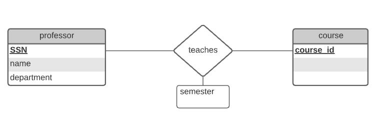
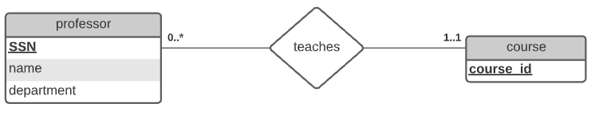
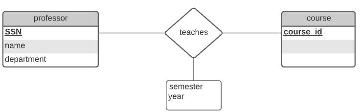
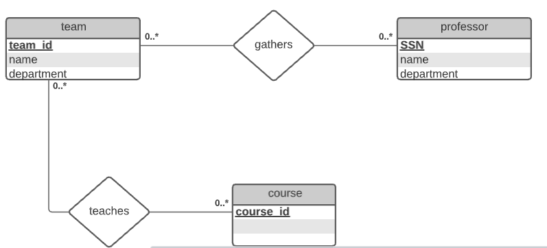
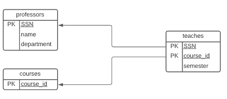
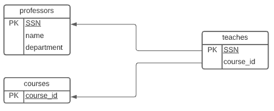
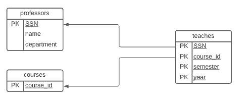
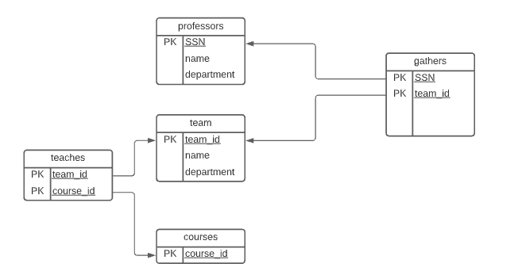

#  Lab04

## Sommaire

| Sommaire | Valeur |
| --- | --- |
| Cours | CSI 2532 |
| Session | Hiver 2021 |
| Professeur | Andrew Forward |
| Equipe | Younes Anys (300145843) |

# Une base de données universitaire

Une base de données universitaire contient des informations sur les professeurs (identifié par le numéro de sécurité sociale ou SSN) et les cours (identifié par courseid). Les professeurs donnent des cours chacun des situations suivantes concernent l'ensemble de relation `teaches`.

## Diagramme ER

Pour chaque situation voici un diagramme ER qui le décrit (en supposant qu'aucune autre contrainte).

1. Les professeurs peuvent enseigner le même cours sur plusieurs semestres et seule la plus récente doit être enregistrée.




3. Chaque professeur enseigne exactement un cours (ni plus, ni moins).




5. Les professeurs peuvent enseigner le même cours sur plusieurs semestres et chaque doit être enregistrée.




6. Supposons maintenant que certains cours puissent être enseignés conjointement par une équipe de professeurs, mais il est possible qu'aucun professeur dans une équipe ne puisse enseigner le cours. Modélisez cette situation en introduisant des ensembles d'entités et des ensembles de relations supplémentaires si nécessaire.



## Diagramme de relation

1. Les professeurs peuvent enseigner le même cours sur plusieurs semestres et seule la plus récente doit être enregistrée.



3. Chaque professeur enseigne exactement un cours (ni plus, ni moins).

   

5. Les professeurs peuvent enseigner le même cours sur plusieurs semestres et chaque doit être enregistrée.

   

6. Supposons maintenant que certains cours puissent être enseignés conjointement par une équipe de professeurs, mais il est possible qu'aucun professeur dans une équipe ne puisse enseigner le cours. Modélisez cette situation en introduisant des ensembles d'entités et des ensembles de relations supplémentaires si nécessaire.

   

## Schéma de relation

1. Les professeurs peuvent enseigner le même cours sur plusieurs semestres et seule la plus récente doit être enregistrée.


#### Schema correspondant

```sql
CREATE TABLE professors(
	SSN int,
	name varchar(100),
    department varchar(100),
    PRIMARY KEY(SSN)
);
CREATE TABLE courses(
	course_id int,
    PRIMARY KEY(course_id)
);
CREATE TABLE teaches(
	SSN int,
	course_id int,
    semester varchar(50),
    PRIMARY KEY(SSN,course_id),
    FOREIGN KEY (SSN) references professors(SSN),
    FOREIGN KEY (course_id) references courses(course_id)
);
```

3. Chaque professeur enseigne exactement un cours (ni plus, ni moins).


#### Schema correspondant

```sql
CREATE TABLE professors(
	SSN int,
	name varchar(100),
    department varchar(100),
    PRIMARY KEY(SSN)
);
CREATE TABLE courses(
	course_id int,
    PRIMARY KEY(course_id)
);
CREATE TABLE teaches(
	SSN int,
	course_id int,
    PRIMARY KEY(SSN),
    FOREIGN KEY (SSN) references professors(SSN),
    FOREIGN KEY (course_id) references courses(course_id)
);
```

5. Les professeurs peuvent enseigner le même cours sur plusieurs semestres et chaque doit être enregistrée.


#### Schema correspondant

```sql
CREATE TABLE professors(
	SSN int,
	name varchar(100),
    department varchar(100),
    PRIMARY KEY(SSN)
);
CREATE TABLE courses(
	course_id int,
    PRIMARY KEY(course_id)
);
CREATE TABLE teaches(
	SSN int,
	course_id int,
    semester varchar(50),
    _year int(4),
    PRIMARY KEY(SSN,course_id,semester,_year),
    FOREIGN KEY (SSN) references professors(SSN),
    FOREIGN KEY (course_id) references courses(course_id)
);
```

6. Supposons maintenant que certains cours puissent être enseignés conjointement par une équipe de professeurs, mais il est possible qu'aucun professeur dans une équipe ne puisse enseigner le cours. Modélisez cette situation en introduisant des ensembles d'entités et des ensembles de relations supplémentaires si nécessaire.


#### Schema correspondant

```sql
CREATE TABLE professors(
	SSN int,
	name varchar(100),
    department varchar(100),
    PRIMARY KEY(SSN)
);
CREATE TABLE team(
	team_id int,
	name varchar(100),
    department varchar(100),
    PRIMARY KEY(team_id)
);
CREATE TABLE courses(
	course_id int,
    PRIMARY KEY(course_id)
);
CREATE TABLE teaches(
	team_id int,
	course_id int,
    PRIMARY KEY(team_id,course_id),
    FOREIGN KEY (SSN) references professors(SSN),
    FOREIGN KEY (course_id) references courses(course_id)
);
CREATE TABLE gathers(
	team_id int,
	SSN int,
    PRIMARY KEY(team_id,course_id),
    FOREIGN KEY (team_id) references team(team_id),
   	FOREIGN KEY (SSN) references professors(SSN)
);
```
